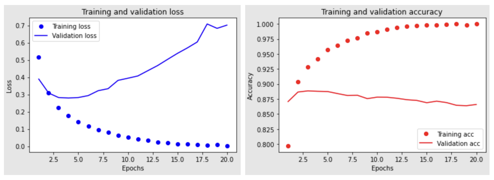

# 졸업프로젝트 중간점검
### 3월 과제: Keras 연습
응용미술교육과 
2018030328 신영은

---
# 목차
1. **DNN**
    1. 이진 분류 문제: IMDB 데이터셋
    2. 다중 분류 문제: 로이터 데이터셋
    3. 회귀 문제: 보스턴 주택 데이터셋
2. **모델 튜닝**
    1. 네트워크 크기 축소
    2. 드롭아웃 추가
    3. 가중치 규제 추가
3. **CNN**
    1. 작은 데이터셋 이진 분류 문제: Kaggle Cats vs Dog
    2. 사전 훈련된 Convnet 사용하기: VGG16
    3. Convnet의 학습 시각화하기
3. **RNN**
    1. simple RNN, LSTM 모델을 사용한 이진 분류 문제: IMDB 데이터셋
    2. GRU 모델을 사용한 기온 예측 문제: Jena Climate Dataset
---
# 1. MLP 예제
## 1.1. 이진 분류 문제
> IMDB dataset 영화 리뷰 분류
### 1.1.1. 데이터 준비하기
#### 1.1.1.1 IMDB 데이터셋 로드 후 훈련, 테스트 데이터로 나누기
* 훈련과 테스트를 같은 데이터로 하면 안됨!
    * 모델은 처음 보는 데이터에 대한 성능이 중요!
    * 모델에는 이미 훈련 데이터에 맞는 규칙이 반영되었기 때문에 성능 평가 단계에서는 학습에 사용되지 않은 데이터 사용

    ```python
    from keras.datasets import imdb
    # 가장 자주 사용되는 단어 10,000개만 사용
    (train_data, train_labels), (test_data, test_labels) = imdb.load_data(num_words=10000)
    ```
---
## 1.1. 이진 분류 문제
### 1.1.1. 신경망에 주입할 데이터 준비하기
* 숫자 리스트를 원-핫 인코딩하여 0과 1의 벡터로 변환 
* **원-핫 인코딩**:
    1. 단어 집합의 크기를 벡터의 차원 만들기 
    2. 표현하고 싶은 단어의 인덱스에 1의 값을 부여하고, 다른 인덱스는 모두 0으로 만들기

    ```python
    def vectorize_sequences(sequences, dimension=10000):
        results = np.zeros((len(sequences), dimension))
        for i, sequence in enumerate(sequences):
            results[i, sequence] = 1.
        return results
    ```
---
## 1.1. 이진 분류 문제
### 1.1.2. 신경망 모델 만들기
#### 1.1.2.1 완전 연결 신경망
* ```relu``` 활성화 함수를 사용한 ```Dense```층 쌓기
    1. 16개의 은닉 유닛을 가진 두 개의 은닉층
    2. 현재 리뷰의 감정을 스칼라 값의 예측으로 출력하는 마지막 층
        * ```sigmoid```사용: 임의의 값을 [0, 1] 사이로 압축 -> 출력 값을 **확률**처럼 해석
    ```python
    from keras import models
    from keras import layers

    model = models.Sequential()
    model.add(layers.Dense(16, activation='relu', input_shape=(10000,)))
    model.add(layers.Dense(16, activation='relu'))
    model.add(layers.Dense(1, activation='sigmoid'))
    ```
---
## 1.1. 이진 분류 문제
#### 1.1.2.2. 옵티마이저, 손실함수 설정
* 옵티마이저: rmsprop
* 손실함수: 
    * 이진 분류 -> binary_crossentropy
    * 확률을 출력하는 모델이므로 확률 분포 간의 차이를 측정하는 크로스엔트로피 쓰기 (원본 분포와 예측 분포 사이를 측정)
    ```python
    model.compile(optimizer='rmsprop',
                loss='binary_crossentropy',
                metrics=['accuracy']) # 정확도를 사용해 모니터링
    ```
---
## 1.1. 이진 분류 문제
### 1.1.3. 훈련 & 검증하기
#### 1.1.3.1. 검증 세트 만들기
* 훈련 데이터에서 일부 데이터 떼어내 검증 세트 만들기
* 검증용 데이터는 훈련에서 사용되면 안됨! (처음 본 데이터에 대한 모델의 정확도 측정)
#### 1.1.3.2. 모델 훈련하기
* ```model.fit()```: 
    * ```History``` 객체 반환
    * 훈련하면서 발생한 모든 정보를 담고있는 딕셔너리  ```history```속성을 가짐
    ```python
    history = model.fit(partial_x_train,
                        partial_y_train,
                        epochs=20,
                        batch_size=512,
                        validation_data=(x_val, y_val))
    ```
---
## 1.1. 이진 분류 문제
#### 1.1.3.3. 훈련과 검증 그래프
* matplot으로 훈련과 검증 손실 & 정확도 그래프 그리기

* 4번째 epoch부터 **과대적합** 발생!
    * 훈련 데이터에 과도하게 최적화되어 새로운 데이터에 일반화 X
    * 과대적합 발생 전까지만 훈련하고 테스트데이터로 평가하기
---
## 1.1. 이진 분류 문제
### 1.1.4. 테스트 데이터에서 평가
* 과대적합 발생 전까지만 훈련한 후 test 데이터로 평가하기
* ```evaluate()```: 모델의 최종적인 정답률과 loss값 알 수 있음
* 테스트셋으로 모델 평가 결과: **88.5%** 정확도 달성
### 1.1.5. 훈련된 모델로 새로운 데이터에 대해 예측하기
* ```predict()```: 데이터가 양성 샘플(label=1)일 확률 예측
    ```python
    model.predict(x_test)
    ```
### 1.1.6. 정리
1. 원본 데이터를 신경망에 주입 전에 **전처리** 하기
1. 출력 class가 2개인 **이진분류** 문제는 **1개의 unit**과 **Sigmoid** 활성화 함수를 가진 Dense 층으로 끝내기
2. 이진 분류의 스칼라 sigmoid 출력에는 **binary_crossentropy** 손실함수 쓰기
---
## 1.2. 다중 분류 문제
> 로이터 dataset 뉴스 토픽(46가지) 분류
### 1.2.1. 신경망에 주입할 데이터 준비하기
* 가장 자주 사용되는 단어 10,000개를 제한으로 데이터 load
* 이진 분류와 동일한 방식인 원-핫 인코딩으로 벡터화
    * 케라스 내장 함수 ```to_categorical```사용
        ```python
        from keras.utils.np_utils import to_categorical

        one_hot_train_labels = to_categorical(train_labels)
        one_hot_test_labels = to_categorical(test_labels)
        ```
---
## 1.2. 다중 분류 문제
### 1.2.2. 모델 구성
* 출력 class: 46개 (46가지 토픽으로 분류)
    * 마지막 층 
        * 크기: 46
        * 활성화 함수: ```softmax``` (샘플이 각 46개 class에 속할 확률분포 출력)
    * 은닉 유닛 갯수를 64개로 증가
        * 이진 분류 예제와 달리 유닛이 너무 작으면 정보의 **병목** 현상으로 유용한 정보를 잃을 수 있음
* 손실함수: ```categorical_crossentropy``` -> 출력한 확률 분포와 진짜 레이블 분포 간의 거리
    ```python
    from keras import models
    from keras import layers

    model = models.Sequential()
    model.add(layers.Dense(64, activation='relu', input_shape=(10000,)))
    model.add(layers.Dense(64, activation='relu'))
    model.add(layers.Dense(46, activation='softmax'))

    model.compile(optimizer='rmsprop', loss='categorical_crossentropy', metrics=['accuracy'])
    ```
---
## 1.2. 다중 분류 문제
### 1.2.3. 훈련 검증
* train 데이터셋 일부(1000개)를 떼어내 검증 셋으로 사용

* 8번 에포크 이후 과대적합 발생 -> 에포크 8번으로 감소한 후 테스트

---
## 1.2. 다중 분류 문제
### 1.2.4. 테스트 결과
* 테스트셋으로 모델 평가 결과: **78%** 정확도 달성
### 1.2.5. 정리
* N개의 클래스로 데이터 분류 -> 마지막 Dense 층 크기: N
* 단일 레이블 다중 분류 문제는 활성화 함수```softmax```사용.(N개의 클래스에 대한 확률 분포를 출력)
* loss함수 ```categorical_crossentropy``` 사용. (모델이 출력한 확률 분포와 타깃 분포 사이의 거리를 최소화)
* 많은 수의 범주로 분류할 때 중간층의 크기 충분하게 -> **정보의 병목** 생기지 않도록!
---
## 1.3. 회귀 문제
> boston 주택 가격 예측
### 1.3.1. 데이터 준비
* 개수가 적은 데이터 셋(총 506개)
    * 훈련 샘플 404개, 테스트 샘플 102개
* 입력 데이터의 각 특성(총 13개)의 스케일이 서로 다름
    * 네트워크에 주입 전 **특성별로 정규화** -> 특성의 중앙 0 근처에 맞춤 +  표준 편차 1로
        ```python
        mean = train_data.mean(axis=0)
        train_data -= mean # 평균을 빼고
        std = train_data.std(axis=0)
        train_data /= std # 표준 편차로 나누기

        test_data -= mean
        test_data /= std
        ```
    * 정규화 시 **훈련 데이터에서 계산한 값** 사용!
        * 훈련 시 절대 테스트 데이터에서 계산한 값을 사용하면 안됨,,
---
## 1.3. 회귀 문제
### 1.3.2. 모델 구성
* 샘플의 수가 적으므로 과대적합 일어나기 쉽다
    * **작은 모델** 사용하기: 64개 unit 가진 2개의 층
* 마지막 층: **선형 층** (활성화 함수 없음)
    * 어떤 범위의 값이라도 예측하도록 자유롭게 학습 가능!
* 손실함수 : ```mse```(평균 제곱 오차) -> 예측과 타깃 사이 거리의 제곱
* 모니터링 : ```mae```(평균 절대 오차)
    ```python
    model = models.Sequential()
    model.add(layers.Dense(64, activation='relu', input_shape=(train_data.shape[1],)))
    model.add(layers.Dense(64, activation='relu'))
    model.add(layers.Dense(1))
    model.compile(optimizer='rmsprop', loss='mse', metrics=['mae'])
    ```
---
## 1.3. 회귀 문제
### 1.3.3. K-fold 교차검증으로 훈련 검증
* 작은 데이터셋 -> 검증 세트와 훈련 세트로 어떤 데이터가 선택됐는지에 따라 검증 점수가 크게 달라지게 된다!
* 데이터를 K개의 폴드로 나누고, K개의 모델을 각각 만들어 K - 1개의 분할에서 훈련하고 나머지 분할에서 평가하기
* 검증 점수: K 개의 검증 점수의 평균
    ```python
    num_epochs = 500
    all_mae_histories = [] # 각 폴드 별 검증 점수 로그에 저장
    for i in range(k):
        # 검증 데이터 준비: k번째 분할
        val_data = train_data[i*num_val_samples: (i+1) *num_val_samples]
        val_targets = train_targets[i*num_val_samples: (i+1)*num_val_samples]
        
        # 훈련 데이터 준비: 나머지 분할 전체
        partial_train_data = np.concatenate([train_data[:i*num_val_samples],
        train_data[(i+1)*num_val_samples:]],axis=0)
        partial_train_targets = np.concatenate([train_targets[:i*num_val_samples],
        train_targets[(i+1)*num_val_samples:]],axis=0)
        
        model = build_model()
        history= model.fit(partial_train_data, partial_train_targets, validation_data=(val_data, val_targets), epochs=num_epochs, batch_size=1)
        mae_history = history.history['val_mean_absolute_error']
        all_mae_histories.append(mae_history)
    ```
---
## 1.3. 회귀 문제
#### 1.3.4. 검증 결과
* 모든 폴드에 대한 에포크의 MAE 평균 그래프

* 약 80번째 에포크 이후 과대적합 
    * 에포크 80번으로 줄인 후 전체 훈련 데이터(훈련+검증)로 모델 훈련 
---
## 1.3. 회귀 문제
### 1.3.5. 테스트 결과
* 테스트 데이터로 성능 확인 : ```evaluate()```사용
* 약 2,774$ 차이
### 1.3.6. 정리
1. 스칼라 회귀 문제는 ```MSE``` 손실함수 사용.
2. 평가 지표: ```MAE```평균 절대 오차
3. 입력 데이터 특성이 서로 다른 범위를 가지면 전처리 단계에서 각 특성별 **스케일 조정**
4. 데이터가 적을땐 **K-fold 교차검증** 사용
5. 훈련 데이터가 적을땐 과대적합 방지를 위해 **작은 모델** 사용
---
# 2. 모델 튜닝
> IMDB 영화리뷰 이진분류 문제
### 2.0.1. 최적화 vs 일반화
* 최적화: 가능한 훈련 데이터에서 최고의 성능을 얻기위해 모델 조정(머신 러닝의 학습) 
* 일반화: 훈련된 모델이 처음 보는 데이터에서 얼마나 잘 수행되는가?
### 2.0.2. 과대적합
* 훈련 데이터에 여러 번 반복 학습하면 어느 시점부터 일반화 성능이 더이상 높아지지 않음
* 검증 세트 성능이 멈추고 감소
* 훈련 데이터에 특화된 패턴을 학습하기 시작 -> 패턴은 새로운 데이터와 관련성 적어..
### 2.0.3. 일반화 성능이 뛰어난 모델 만들기
1. 많은 훈련 데이터 모으기
2. 모델이 수용할 수 있는 정보의 양을 조절하거나 저장할 수 있는 정보에 제약을 가하기
---
# 2. 모델 튜닝
## 2.1. 네트워크 크기 축소
> 적은 수의 패턴만을 기억할 수 있다면 최적화 과정에서 가장 중요한 패턴에 집중하게 된다.
### 2.1.1. 파라미터 줄이기
* 파라미터 갯수: 층의 수 & 각 층의 unit 수에 의해 결정
    * 파라미터가 많은 모델이 기억 용량이 더 많다.. -> 너무 많으면 일반화 안됨
* **기억 용량에 제한** -> 타깃에 대한 예측 성능을 가진 **압축된 표현**을 학습!
* 단, 과소적합되지 않도록 절충점 찾기
    ```python
    # 원본 모델
    model1 = models.Sequential()
    model1.add(layers.Dense(16, activation='relu', input_shape=(10000,)))
    model1.add(layers.Dense(16, activation='relu'))
    model1.add(layers.Dense(1, activation='sigmoid'))
    # 작은 용량의 모델
    model2 = models.Sequential()
    model2.add(layers.Dense(6, activation='relu', input_shape=(10000,)))
    model2.add(layers.Dense(6, activation='relu'))
    model2.add(layers.Dense(1, activation='sigmoid'))
    ```
---
## 2.1. 네트워크 크기 축소
### 2.1.2. 모델 용량 제한 결과

* 큰 네트워크:
    * 훈련 손실: 빠르게 0으로
    * 검증 손실: 4번째 에포크부터 과대적합
* 작은 네트워크:
    * 훈련 손실: 천천히 줄어듦
    * 검증 손실: 8번째 에포크부터 과대적합
---
## 2.2. 드롭아웃 추가
> 층의 출력 값에 노이즈를 추가하여 중요하지 않은 우연한 패턴을 깨뜨리기
### 2.2.1. 드롭아웃
* 훈련하는 동안 무작위로 층의 일부 출력 특성을 제외(0으로)
* 드롭아웃 비율: 0이 될 특성의 비율(보통 0.2-0.5)
* keras에서는 층의 출력 바로 뒤에 ```Dropout``` 추가하여 적용 (예시: ```model.add(layers.Dropout(0.5))```)
    ```python
    # 원본 모델
    model1 = models.Sequential()
    model1.add(layers.Dense(16, activation='relu', input_shape=(10000,)))
    model1.add(layers.Dense(16, activation='relu'))
    model1.add(layers.Dense(1, activation='sigmoid'))

    # 드롭아웃(50%)
    model2 = models.Sequential()
    model2.add(layers.Dense(16, activation='relu', input_shape=(10000,)))
    model2.add(layers.Dropout(0.5))
    model2.add(layers.Dense(16, activation='relu'))
    model2.add(layers.Dropout(0.5))
    model2.add(layers.Dense(1, activation='sigmoid'))
    ```
---
## 2.2. 드롭아웃 추가
### 2.2.2. 드롭아웃 결과

* 테스트셋으로 모델 평가 결과:
    * Original: 85.3%
    * Dropout: 87.6%


---
## 2.3. 가중치 규제 추가
> **가중치** W가 클수록 더 큰 **페널티**를 부과해 inpux 'x'에 대해 지나치게 fit 하지 않도록

### 2.3.1. 가중치 규제
#### 2.3.1.1. L1 규제
* 가중치의 **절대값**에 비례하는 비용 추가 -> 일부 가중치 값을 완전히 0으로 만들 수 있음
    ```python
    model2 = models.Sequential()
    model2.add(layers.Dense(16, kernel_regularizer=regularizers.l1(0.0001), activation='relu', input_shape=(10000,)))
    model2.add(layers.Dense(16, kernel_regularizer=regularizers.l1(0.0001), activation='relu'))
    model2.add(layers.Dense(1, activation='sigmoid'))
    ```
#### 2.3.1.2. L2 규제
* 가중치의 **제곱**에 비례하는 비용 추가 -> 가중치 값을 작게 만들지만 완전히 0이 되지 않음
    ```python
    model3 = models.Sequential()
    model3.add(layers.Dense(16, kernel_regularizer=regularizers.l2(0.001), activation='relu', input_shape=(10000,)))
    model3.add(layers.Dense(16, kernel_regularizer=regularizers.l2(0.001), activation='relu'))
    model3.add(layers.Dense(1, activation='sigmoid'))
    ```
---
## 2.3. 가중치 규제 추가
### 2.3.2. 가중치 규제 결과
* 같은 파라미터 수를 가지고 있어도 과대적합에 잘 견디고 있음.

* 테스트셋으로 모델 평가 결과:
    * Original: 83.6%
    * l1(0.0001): 85.6%
    * l2(0.001): 86.3%

---
# 3. CNN
> Kaggle Cats vs Dog
## 3.1. 작은 데이터셋 이진 분류 문제
### 3.1.1. 합성곱 신경망 (Convnet)
* **지역 패턴**을 학습: 이미지의 경우 2D 윈도우로 입력에서 패턴을 찾는다
* **평행 이동 불변성**: 적은 수의 훈련 샘플을 사용해 일반화 능력을 가진 표현을 학습
* **패턴의 공간적 계층 구조를 학습**: 작은 지역 패턴 -> 더 큰 패턴 학습
---
## 3.1. 작은 데이터셋 이진 분류 문제
### 3.1.2. 네트워크 구성하기
* ```Conv2D```(```relu``` 활성화 함수 사용)와 ```MaxPooling2D``` 층을 번갈아 쌓은 **컨브넷** 만들기
* 마지막 층: 이진분류이므로,, ```sigmoid``` + 유닛 1개
    ```python
    from keras import layers
    from keras import models
    model = models.Sequential()
    # 컨브넷
    model.add(layers.Conv2D(32,(3,3), activation='relu', input_shape=(150,150,3)))
    model.add(layers.MaxPooling2D((2,2)))
    model.add(layers.Conv2D(64,(3,3), activation='relu'))
    model.add(layers.MaxPooling2D((2,2)))
    model.add(layers.Conv2D(128,(3,3), activation='relu'))
    model.add(layers.MaxPooling2D((2,2)))
    model.add(layers.Conv2D(128,(3,3), activation='relu'))
    model.add(layers.MaxPooling2D((2,2)))
    # 완전 연결 분류기
    model.add(layers.Flatten())
    model.add(layers.Dense(512, activation='relu'))
    model.add(layers.Dense(1, activation='sigmoid'))
    ```
---
## 3.1. 작은 데이터셋 이진 분류 문제
### 3.1.3. 데이터 전처리
* 네트워크에 JPEG 이미지 주입하기 위해 데이터 전처리
    1. 사진 파일 JPEG 콘텐츠를 RGB 픽셀 값으로 디코딩
    2. 부동 소수 타입의 텐서로 변환
    3. 픽셀 값(0에서 255 사이)의 스케일을 [0, 1] 사이로 조정 (신경망은 작은 입력 값을 선호하기 때문)
* ```keras.preprocessing.image```의 ```ImageDataGenerator```클래스로 이미지 파일을 배치 텐서로 바꾸는 제너레이터 만들기

### 3.1.4. 배치 제네레이터를 사용해 모델 훈련
* 하나의 에포크 정의하기 위해 **제너레이터로부터 얼마나 많은 샘플 뽑을지** 지정
    * steps_per_epoch: 전체 훈련 데이터 수 / train_generator 배치 수
    * validation_step: 전체 검증 데이터 수 / validation_generator 배치 수
---
## 3.1. 작은 데이터셋 이진 분류 문제
### 3.1.5. 데이터 증식
* 학습할 샘플이 너무 적으면 새로운 데이터에 일반화할 수 있는 모델을 훈련시킬 수 없음 (과대적합 발생) 
**-> 기존의 훈련 샘플로부터 더 많은 훈련 데이터를 생성하자!**
* keras에서는 ```ImageDataGenerator```를 이용해 이미지에 여러 종류의 랜덤 변환을 적용할 수 있음

* 단, 검증 데이터와 테스트 세트는 증식 X
### 3.1.6. 드롭아웃 적용하기
* 증식된 이미지는 적은 수의 원본 이미지에서 만들어졌기 때문에 여전히 입력 데이터들 사이에 상호 연관성이 큼
* 과대적합을 억제하기 위해 완결연결층 전에 **드롭아웃 층** 추가
---
## 3.1. 작은 데이터셋 이진 분류 문제
### 3.1.7. 훈련과 검증 결과
* 데이터 증식 & 드롭아웃 적용 전: 72.4%

* 데이터 증식 & 드롭아웃 적용 후: 76.6%

    * 훈련과 검증 그래프 가까워짐
---
## 3.2. 사전 훈련된 Convnet 사용하기
> VGG16 컨브넷 구조 사용
### 3.2.1. 사전 훈련된 네트워크
* 일반적으로 대규모 이미지 분류 문제를 위해 **대량의 데이터셋에서 미리 훈련되어 저장된 네트워크**
### 3.2.2. 특성 추출
#### 3.2.2.1. 합성곱 층 재사용하기
* 합성곱 층에 의해 학습된 표현은 **일반적**이어서 재사용 가능하다!
    * 완전 연결 분류층은 모델이 훈련된 클래스 집합에 특화되어있으므로 **합성곱 층만 재사용**
* 층의 깊이에 따라 층에서 추출한 표현의 일반성(재사용성)의 수준이 다르다!
    * **하위 층**: 지역적이고 매우 **일반적**인 특성맵(에지, 색깔, 질감 등) 추출
    * 상위 층: 좀 더 **추상적**인 개념('강아지 눈', '고양이 귀'등) 추출
    * 새로운 데이터셋이 원본 모델이 훈련한 데이터셋과 많이 다르면 모델의 하위 층 일부만 특성 추출에 사용    
---
## 3.2. 사전 훈련된 Convnet 사용하기
#### 3.2.2.2. VGG16

* ImageNet 데이터셋에서 훈련된 VGG16 모델의 합성곱 기반층 추출
---
## 3.2. 사전 훈련된 Convnet 사용하기
#### 3.2.2.3. Case1: 데이터 증식을 사용하지 않는 빠른 특성 추출
> 새로운 데이터셋에서 합성곱 기반 층 실행 후 출력 -> **독립된 완전 연결 분류기**에 입력
* 사전 훈련된 합성곱 기반 층을 사용한 특성 추출:
    ```ImageDataGenerator```를 사용해 이미지와 레이블을 넘파이 배열로 추출 (디스크에 저장)
* 빠르고 cost 적음
* **데이터 증식 사용 불가**
    ```python
    # VGG16 합성곱 기반 층
    from tensorflow.keras.applications import VGG16

    conv_base = VGG16(weights='imagenet', 
                      include_top= False, # 상위 층은 제외
                      input_shape=(150, 150, 3)) 
    ```
    ```python
    # 독립된 완전 연결 분류기
    model = models.Sequential()
    model.add(layers.Dense(256, activation='relu', input_dim=4 * 4 * 512))
    model.add(layers.Dropout(0.5)) # 드롭아웃 층 추가하여 과대적합 방지
    model.add(layers.Dense(1, activation='sigmoid'))
    ```
---
## 3.2. 사전 훈련된 Convnet 사용하기
#### 3.2.2.3. Case1: 데이터 증식을 사용하지 않는 빠른 특성 추출

* 테스트셋으로 모델 평가 결과: 89.0% 정확도
* 과대적합 문제 발생! -> 데이터 증식 필요
---
## 3.2. 사전 훈련된 Convnet 사용하기
#### 3.2.2.4. Case2: 데이터 증식을 사용한 특성 추출
> **모델 확장** -> 입력 데이터를 사용해 **end-to-end** 로 실행
* 합성곱 기반 층 위에 완전 연결 분류기 추가
    * 매우 느림..
    * **데이터 증식 사용 가능**
    ```python
    model = models.Sequential()
    model.add(conv_base)
    # 컨브넷 위에 완전 연결 분류기 추가
    model.add(layers.Flatten())
    model.add(layers.Dense(256, activation='relu'))
    model.add(layers.Dense(1, activation='sigmoid'))
    ```
##### 3.2.2.4.1. 합성곱 기반 층 동결
* 훈련하는 동안 가중치가 업데이트되지 않도록 막기
    * 합성곱 기반층에 의해 사전에 학습된 표현이 훈련하는 동안 수정되지 않도록
    * ```conv_base.trainable = False```
---
## 3.2. 사전 훈련된 Convnet 사용하기
#### 3.2.2.4. Case2: 데이터 증식을 사용한 특성 추출
##### 3.2.2.4.2. 모델 훈련 결과
* 훈련 **데이터 증식**하여 훈련 (단 검증, 테스트 데이터는 증식 X)


* 테스트셋으로 모델 평가 결과: 90.5% 정확도

---
## 3.2. 사전 훈련된 Convnet 사용하기
### 3.2.3. 미세 조정
> 특성 추출에 사용했던 **동결 모델의 상위 층 몇 개를 동결에서 해제**하고 모델에 새로 추가한 층과 함께 훈련
* 맨 위의 **분류기(완전 연결 분류기)가 훈련된 후** 합성곱 기반의 상위 층 미세조정 가능
    * 미리 훈련되지 않으면 훈련하는 동안 너무 큰 오차 신호가 네트워크에 전파
    * 미세조정될 층들이 사전에 학습한 표현 망가뜨리지 않도록 분류기 미리 훈련시키기
* VGG16 모델의 마지막 3개의 합성곱 층 미세 조정(block5_conv1, block5_conv2, block5_conv3)
    ```python
    conv_base.trainable = True
    set_trainable = False
    for layer in conv_base.layers:
        if layer.name == 'block5_conv1':
            set_trainable = True
        if set_trainable:
            layer.trainable = True
        else:
            layer.trainable = False
    ```
---
## 3.2. 사전 훈련된 Convnet 사용하기
#### 3.2.3.1. 왜 미세조정은 적은 층만 하는지?
* 새로운 문제에 재활용하려면 **구체적이고 특화된 특성만 미세 조정**하는 것이 유리!!
    * 하위 층: 일반적이고 재사용 가능한 특성 인코딩
    * **상위 층**: 데이터에 특화된 특성을 인코딩

* 훈련해야 할 파라미터가 많을수록 과대적합의 위험이 커짐
    * **작은 데이터셋으로 합성곱 기반층 전체를 훈련하기엔 위험**
#### 3.2.3.2. 학습률을 낮춘 RMSProp 옵티마이저 사용해 컴파일
* 미세 조정하는 세 개의 층에서 학습된 표현을 조금씩 수정하기 위해 **학습률 낮춤**
    * 변경량이 너무 크면 학습된 표현에 나쁜 영향을 끼칠 수 있음
    ```python
    model.compile(loss='binary_crossentropy',
              optimizer=optimizers.RMSprop(lr=1e-5),
              metrics=['acc'])
    ```
---
## 3.2. 사전 훈련된 Convnet 사용하기
#### 3.2.3.3. 학습 & 검증 결과 (지수 이동 평균 그래프)

* 테스트셋으로 모델 평가 결과: 91.1% 정확도
#### 3.2.4. 정리
1. **작은 데이터셋은 과대적합**이 큰 문제 -> **데이터 증식**으로 억제
2. **특성 추출**로 새로운 데이터셋에 **기존 convnet 재사용** 가능
3. 특성 추출을 보완하기 위해 **미세조정** 사용 (미세조정: 기존 모델에서 전에 학습한 표현의 일부를 새로운 문제에 적응시키기)
---
## 3.3. Convnet의 학습 시각화하기
> convnet의 표현은 시각적인 개념을 학습한 것이기 때문에 시각화할 수 있다
### 3.3.1. Convnet 시각화 기법 개요
1. Convnet **중간 층의 출력** 시각화
    * 연속된 컨브넷 층이 입력을 어떻게 변형시킬까?
    * 개별적인 컨브넷 필터의 의미 파악하기

2. Convnet **필터** 시각화
    * 컨브넷 필터가 찾으려는 시각적인 패턴와 개념을 이해하기

3. 클래스 활성화에 대한 **heatmap**을 이미지에 시각화
    * 이미지의 어떤 부분이 주어진 클래스에 속하는 데 기여했을까?
    * 이미지에서 객체 위치를 추정(localization)하기
---
## 3.3. Convnet의 학습 시각화하기
### 3.3.2. 중간 층의 활성화 시각화하기
* 어떤 입력이 주어졌을 때 네트워크에 있는 여러 합성곱과 풀링 층이 출력하는 특성 맵 그리기
* 네트워크에 의해 학습된 필터들이 **어떻게 입력을 분해하는지 보여줌**
#### 3.3.2.1. 결과


---
## 3.3. Convnet의 학습 시각화하기
#### 3.3.2.2. 특이점
> 반복적인 변환을 통해 관계없는 정보를 걸러내고 유용한 정보는 강조되고 개선됨
* 1번 층은 초기 사진에 있는 거의 모든 정보가 유지됨
* 상위 층으로 갈수록 활성화는 점점 **추상적**(시각적으로 이해하기 어려워짐)
        * '고양이 귀' , '고양이 눈'처럼 **고수준 개념을 인코딩**하기 시작
    * 이미지의 시각적 콘텐츠 정보 감소
    * **이미지 클래스**(타깃에 관한 정보)**에 관한 정보 증가** 

* **비어있는 활성화**가 층이 깊어지면서 증가
    * 필터에 인코딩된 패턴이 입력 이미지에 나타나지 않았음을 의미
---
## 3.3. Convnet의 학습 시각화하기
### 3.3.3. 컨브넷 필터 시각화하기
* 각 **필터**가 반응하는 **시각적 패턴** 확인하기
* 층과 필터의 **활성화를 최대화하기 위한 손실 함수 정의**
* 빈 입력 이미지에서 시작해 특정 필터의 응답을 최대화 하기 위해 컨브넷 입력 이미지에 **경사 상승법** 사용
    ```python
    # 노이즈가 섞인 회색 이미지로 시작
    input_img_data = np.random.random((1, 150, 150, 3)) * 20 + 128.

    step = 1. # 업데이트할 그래디언트의 크기

    # 경사 상승법 n회 실행
    for i in range(n):   
        # 손실 & 그래디언트를 계산
        loss_value, grads_value = iterate([input_img_data])
        # 손실을 최대화하는 방향으로 입력 이미지 수정
        input_img_data += grads_value * step
    ```
    * 결과적으로 선택된 필터가 최대로 응답하는 이미지가 된다.
---
## 3.3. Convnet의 학습 시각화하기
#### 3.3.3.1. 결과

#### 3.3.3.2. 특이점
* 컨브넷의 각 층은 필터의 조합으로 입력을 표현할 수 있는 일련의 필터를 학습!
* 모델의 상위 층으로 갈수록 점점 더 복잡해지고 개선됨.
---
## 3.3. Convnet의 학습 시각화하기
### 3.3.4. 클래스 활성화에 heatmap 시각화하기
* **클래스 활성화 맵**
    * 이미지의 어떤 부분이 컨브넷의 최종 분류 결정에 기여하는가?
    * 특정 출력 클래스에 대해 입력 이미지의 모든 위치를 계산한 2D 점수 그리드!
    
    * 귀 위치에 강한 활성화 -> 컨브넷이 아프리카 코끼리와 인도 코끼리를 '귀'를 중점으로 구분하였음을 알 수 있다.
---
# 4. RNN
## 4.1. simple RNN, LSTM 모델을 사용한 이진 분류 문제
> IMDB dataset 영화 리뷰 분류
### 4.1.1. 단어 임베딩
### 4.1.2. simple RNN
### 4.1.3. LSTM
### 4.1.4. 양방향 LSTM
---
## 4.2. GRU 모델을 사용한 기온 예측 문제
> Jena Climate Dataset 기온 예측
### 4.2.1. Jena Climate 데이터셋 준비
### 4.2.2. GRU를 사용한 모델
### 4.2.3. 순환 드롭아웃
### 4.2.4. 스태킹 GRU
### 4.2.5. 1D convnet과 GRU 연결하기
